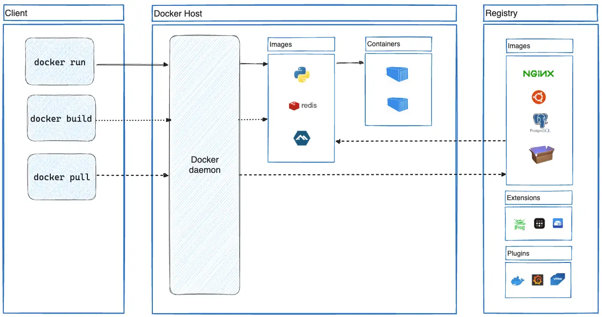
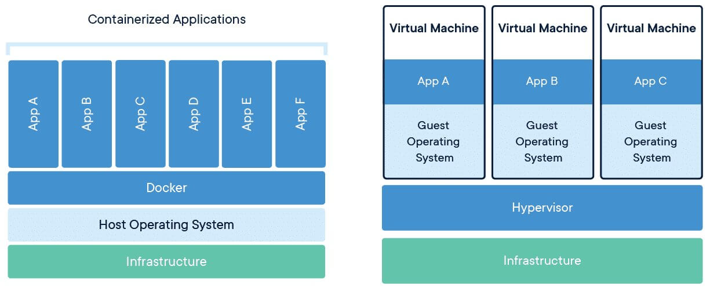
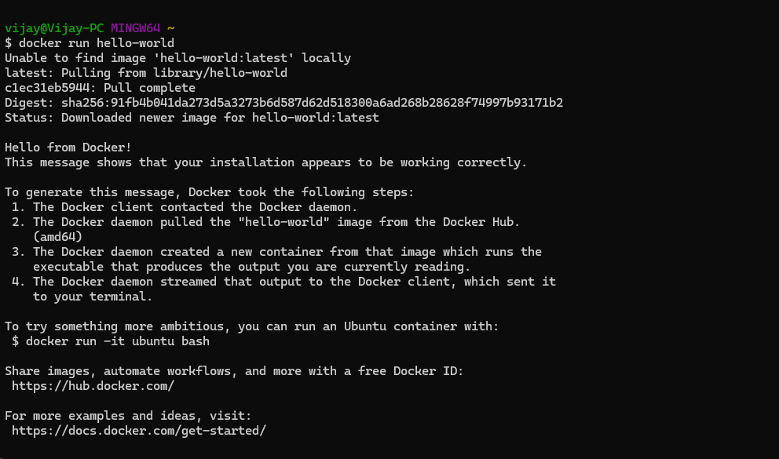

# **Module 1: Introduction to Docker**

## 📚 **Learning Goals**:
- Understand what Docker is and its importance in modern software development.
- Grasp the basic terminology: containers, images, and registries.
- Recognize the key differences between Docker containers and traditional virtual machines.
- Set up Docker on your local machine.

---

## 📘 **Content**:

### 🔹 **What is Docker?**
Docker is an open platform for developing, shipping, and running applications. Docker enables you to separate your applications from your infrastructure so you can deliver software quickly. With Docker, you can manage your infrastructure in the same ways you manage your applications. By taking advantage of Docker's methodologies for shipping, testing, and deploying code, you can significantly reduce the delay between writing code and running it in production.

A container is a standard unit of software that packages up code and all its dependencies so the application runs quickly and reliably from one computing environment to another.

Refer: [Docker - official documentation](https://docs.docker.com/).


### 🔹 **Why Use Docker?**
- **Consistency**: Ensures the application works the same regardless of where it is deployed (dev, staging, production).
- **Portability**: Containers can run on any system that supports Docker, including local machines, data centers, and cloud platforms.
- **Isolation**: Containers run isolated from each other, ensuring security and preventing conflicts.

### 🔹 **Docker Architecture**:
Docker uses a client-server architecture. The Docker client talks to the Docker daemon, which does the heavy lifting of building, running, and distributing your Docker containers. 

</br>
<p align="center">
  
</p>
<p align="center">Architecture diagram of Docker.</p>


Docker uses the following key components:
- **Docker Client**: The Docker Client is a command-line interface (CLI) tool used to interact with the Docker daemon. It sends commands to the Docker daemon, which performs the requested actions like building, running, or pulling images.

- **Docker Engine**:  The core part of Docker, responsible for managing containers, images, networks, and volumes.

- **Images**: Immutable files that contain the source code, libraries, dependencies, tools, and other files needed for an application to run.

- **Containers**: Lightweight instances created from Docker images that run the application.

- **Registries**: Locations where Docker images are stored, such as Docker Hub.

### 🔹 **Containers vs Virtual Machines (VMs)**:
**Containers** and **Virtual Machines (VMs)** both allow applications to run in isolated environments, but they differ significantly in how they achieve this.

#### 1. **Architecture**:

- **VMs**: Run a full guest OS on top of a hypervisor, virtualizing the hardware. Each VM includes the entire OS, which increases overhead.
- **Containers**: Share the host OS and run in isolated processes, using much less overhead.

#### 2. **Performance**:

- **VMs**: Heavier on resources as each VM runs its own OS. Slower to boot and consumes more memory and CPU.
- **Containers**: Lightweight, sharing the host OS. Start in seconds and use fewer resources.

#### 3. **Portability**:

- **VMs**: Less portable due to large size and reliance on hypervisors.
- **Containers**: Highly portable, easy to move between environments (local, cloud, etc.).

#### 4. **Isolation**:

- **VMs**: Strong isolation with full OS-level separation.
- **Containers**: Process-level isolation, which is lighter but may offer less security compared to VMs.

#### 5. **Use Cases**:

- **VMs**: Best for running multiple OSes or when full isolation is required.
- **Containers**: Ideal for microservices, rapid deployment, and when efficiency and portability are key.

</br>
<p align="center">
  
</p>
<p align="center">Illustration showing the difference between containers and VMs.</p>

---

### 🔧 **Setting up Docker**:
Follow the instructions below to install Docker on your operating system.

- **Windows**: Install Docker Desktop [Docker Desktop for Windows](https://docs.docker.com/desktop/install/windows-install/).
- **macOS**: Install Docker Desktop [Docker Desktop for macOS](https://docs.docker.com/desktop/install/mac-install/).
- **Linux**: Follow the instructions specific to your distribution [Install Docker on Linux](https://docs.docker.com/engine/install/).

After installation, verify that Docker is installed correctly by running:
```bash
docker --version
```

---

### 🛠️ **Hands-on Exercise**: Run Your First Container

- `/01-introduction/exercises/`: Hands-on exercise files.

After installing Docker, run the following command to pull and run the `hello-world` container:
```bash
docker run hello-world
```

This command will download a simple Docker image and run it in a container. You should see a message saying "Hello from Docker!" if everything is set up correctly.

</br>
<p align="center">
  
</p>


**Next Steps**:
Once you’ve completed this exercise, you’ll be ready to dive into more complex operations, such as creating your own Docker images and running applications inside containers.

---

### 🎯 **Summary**:
In Module 1, you’ve learned the basics of Docker, installed it on your machine, and successfully ran your first container. Now that you understand Docker’s core concepts and architecture, you’re ready to explore building and running more complex containerized applications.
